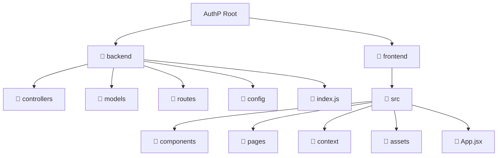
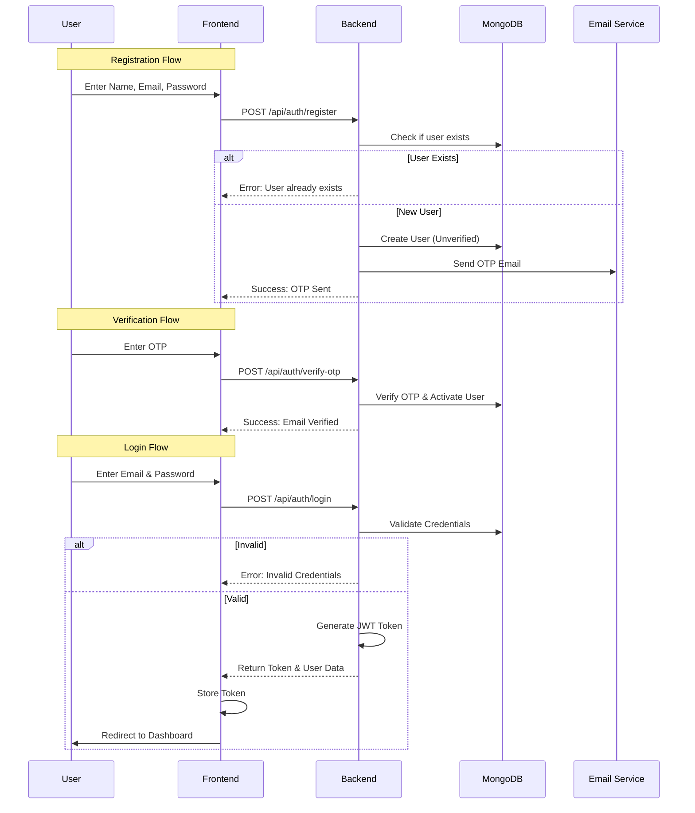

# AuthP - Next-Gen Authentication System 🚀


[](https://nodejs.org/)
[](https://reactjs.org/)
[](https://www.mongodb.com/)
[](https://opensource.org/licenses/MIT)

## 👋 Introduction

Welcome to **AuthP**, a robust and secure authentication system built with the MERN stack. Designed with scalability and user experience in mind, AuthP provides a seamless login and registration flow, complete with email verification and a sleek dashboard. Whether you're building a SaaS platform or a personal project, AuthP gives you the solid foundation you need to manage user identities securely.

## 📸 Demo

> [!NOTE]
> *Video demonstration coming soon! Watch this space for a walkthrough of the authentication flow.*

## ✨ Features

-   **🔐 Secure & Robust**: Implements industry-standard security practices using `bcrypt` for password hashing and `jsonwebtoken` for session management.
-   **📧 Email Verification**: Integrated OTP verification system ensuring legitimate user registrations via `nodemailer`.
-   **🚀 High Performance**: Utilizes **Redis** for efficient caching and session storage, ensuring lightning-fast response times.
-   **🎨 Modern UI**: Built with **React** and **TailwindCSS v4**, featuring a responsive, clean, and professional interface.
-   **🛡️ Protected Routes**: comprehensive route protection to ensure only authenticated users access the dashboard.
-   **📱 Responsive Design**: Fully optimized for desktop, tablet, and mobile devices.

## 🛠️ Tech Stack

This project leverages a powerful modern tech stack:

### Frontend
-   **React (Vite)**: Fast and modern frontend library.
-   **TailwindCSS**: Utility-first CSS framework for rapid UI development.
-   **Axios**: Promise-based HTTP client for the browser.
-   **React Router**: Dynamic routing for single-page applications.

### Backend
-   **Node.js & Express**: Scalable server-side runtime.
-   **MongoDB & Mongoose**: Flexible NoSQL database schema.
-   **Redis**: In-memory data structure store for caching.
-   **Zod**: TypeScript-first schema validation.
-   **Nodemailer**: Module to send emails.

## 🏗️ Architecture

### Project Structure

A high-level view of the project's file organization:



### Authentication Flow

The following sequence diagram illustrates the secure registration and login process:



## 🚀 Getting Started

Follow these steps to set up the project locally.

### Prerequisites

-   Node.js (v16+)
-   MongoDB (Local or Atlas)
-   Redis (Local or Cloud)

### Installation

1.  **Clone the repository:**
    ```bash
    git clone https://github.com/yourusername/authp.git
    cd authp
    ```

2.  **Setup Backend:**
    ```bash
    cd backend
    npm install
    # Create a .env file based on .env.example
    npm run dev
    ```

3.  **Setup Frontend:**
    ```bash
    cd ../frontend
    npm install
    npm run dev
    ```

## 🤝 Contributing

Contributions are welcome! Please feel free to submit a Pull Request.

## 📄 License

This project is open-source and available under the [MIT License](LICENSE).
